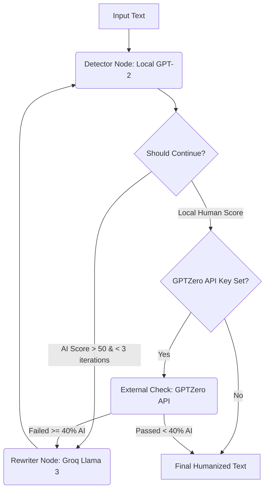

# StealthText 🕵️‍♂️


StealthText is an AI text humanizer that uses a **LangGraph agent loop** to rewrite AI-generated text until it bypasses detection. 

Instead of simple prompt-wrapping, StealthText uses a closed-loop system:
1. **Detect**: Scores text using a local GPT-2 model (evaluating Perplexity and Burstiness).
2. **Rewrite**: If the text scores as "Likely AI", it calls Groq (Llama 3.3 70B) to humanize it according to the selected **Writing Tone**.
3. **Verify (Optional)**: If configured, verifies candidate humanized drafts against the commercial **GPTZero API**.
4. **Evaluate**: Loops back to the detector until the text passes as human, or hits a max iteration limit.

## ✨ Key Features

- **✍️ Tone Control Selector:** Choose between **Casual / Creative** (adds natural hedges, casual transitions, and expressive punctuation) or **Professional / Academic** (preserves formal, objective vocabulary and authoritative syntax while avoiding AI markers).
- **📈 Score Trend Charts:** Visualizes perplexity and burstiness improvements iteration-by-iteration using a real-time line chart.
- **📋 Copy to Clipboard:** Integrated clipboard utility on the humanized output panel with visual success notifications.
- **🛡️ Hybrid Verification (GPTZero Client):** Supports optional validation against commercial detectors, utilizing local GPT-2 pre-screening to conserve API credits.

## 🏗 Architecture

The backend is built with FastAPI and LangGraph, completely decoupled from the Streamlit frontend.



## 🚀 Quick Start (Docker)

The easiest way to run StealthText is via Docker. The GPT-2 model (~500MB) will be downloaded on the first run and cached in a volume.

1. **Clone the repo**
   ```bash
   git clone https://github.com/sandhya-bdb/stealthtext_AI_bypass.git
   cd stealthtext_AI_bypass
   ```

2. **Configure API Keys**
   ```bash
   cp .env.example .env
   ```
   Edit `.env` and add your [Groq API Key](https://console.groq.com/keys). (LangSmith tracing is optional but recommended).

3. **Run with Docker Compose**
   ```bash
   docker compose up --build
   ```

4. **Open the UI**
   Navigate to [http://localhost:8501](http://localhost:8501)

## 💻 Local Development (No Docker)

If you prefer to run it locally without Docker:

1. **Install dependencies**
   ```bash
   python -m venv venv
   source venv/bin/activate
   pip install -r requirements-backend.txt
   pip install -r requirements-frontend.txt
   ```

2. **Run Backend (FastAPI)**
   ```bash
   uvicorn backend.api:app --reload --port 8000
   ```

3. **Run Frontend (Streamlit)**
   ```bash
   streamlit run frontend/app.py --server.port 8501
   ```

## 🧪 Testing

StealthText includes a comprehensive offline test suite (50 tests) using `pytest`. Tests mock the LLM and GPT-2 to run instantly without API keys or GPU.

```bash
pytest tests/ -v
```

## 🔍 Observability

Full execution traces are available via [LangSmith](https://smith.langchain.com/). To enable, set `LANGCHAIN_TRACING_V2=true` and your `LANGCHAIN_API_KEY` in the `.env` file. The UI includes a live status badge reflecting tracing state.

## 📈 System Design & Scalability

This project is built as a production-ready MVP with a decoupled architecture. While it performs extremely well for individual use or small teams, scaling it to 100,000+ users would require the following architectural shifts:

- **Stateful UI (Streamlit) → Stateless UI (Next.js):** Streamlit maintains a persistent WebSocket connection and server-side state for every user. For planet-scale traffic, the frontend would be rewritten in React/Next.js to use stateless REST/GraphQL calls.
- **Local Model (GPT-2) → Dedicated Inference Server (vLLM):** Currently, the GPT-2 model is loaded into the FastAPI worker memory (CPU). At scale, the model would be decoupled into a dedicated GPU inference server (like vLLM or Triton) to prevent the web server from being CPU/RAM bottlenecked.
- **API Rate Limiting (Groq):** To handle high concurrency without hitting Groq's RPM (Requests Per Minute) limits, a router like LiteLLM would be introduced to automatically fall back to secondary providers (like OpenAI or Anthropic) with exponential backoff and retry logic.
